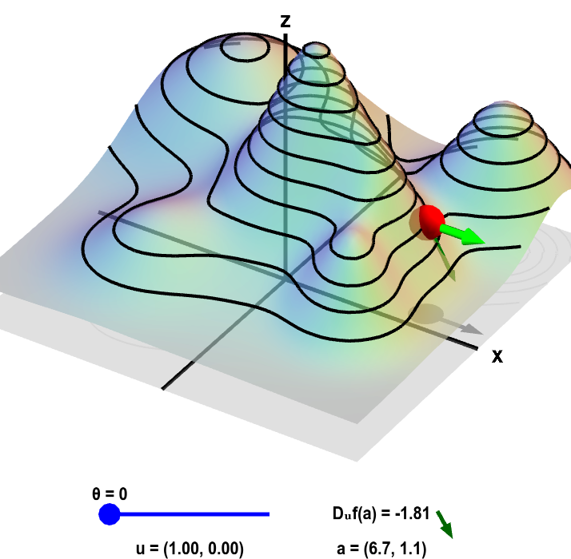

# Badanie wpływu błędów pomiarowych na wynik regresji liniowej
W prezentowanej pracy zakładamy jedynie liniową zależność danych i.e. y = xW + b
## Regresja liniowa
Regresja liniowa to jeden z najprostszych i najbardziej intuicyjnych modeli stosowanych w analizie danych. Zakłada ona istnienie liniowej zależności pomiędzy zmiennymi objaśniającymi (cechami) a zmienną zależną (wynikiem). Może być stosowana bezpośrednio na danych lub po odpowiednich transformacjach, aby spełnić założenie liniowości.
### Postać zamknięta
Łatwo jest dojść do postaci zamkniętaj regresji liniowej, postać ta uzyskiwanana jest przy minimalizacji tzw. least-squares (błędu kwadratowego).

$y = XW + b$

$LS(W, b) = \dfrac{1}{n}||y - XW - b||^2 \Rightarrow LS'(W)\dfrac{1}{n}||y - X'W||^2$

$X' = [X\space1]$  let's pretend W' = W when it comes to notation

$LS'(W) = \dfrac{1}{n}(y - X'W)^T(y - X'W) = y^Ty - y^TX'W - W^TX'^Ty + W^TX'^TX'W$

!!! $(AB)^T = B^TA^T$   !!!

!!! $\dfrac{∂}{∂B}B^TAB = 2AB\space ,\space A\space is\space symetrical: A^T = A$  !!!

$\dfrac{∂LS'}{∂W} = 2X'^TX'W - 2X'^Ty$

$0 = 2X'^TX'W - 2X'^Ty$

$X'^TX'W = X'^Ty$

$W = (X'^TX')^{-1}X'^Ty$

```
class NumpyLinRegCloseForm:
    def __init__(self, bias=False):
        self.bias = bias
        self.weights = None

    @timeit
    def fit(self, x, y):
        if self.bias:
            x = np.hstack((x, np.ones((x.shape[0], 1)))) # x = [x 1]
        try:
            self.weights = np.linalg.inv(x.T @ x) @ x.T @ y
        except:
            warnings.warn("matrix inverse failed, using pseudo inverse instead", Warning)
            self.weights = np.linalg.pinv(x.T @ x) @ x.T @ y
```

### Backpropagation (propagacja wsteczna)
#### Directional derivative (pochodna kierunkowa)
$D_v = <\nabla f, v>$

Pochodna kierunkowa mówi nam jak zachowuje się dana funkcja, gdy chcielibyśmy się poruszyć w danym kierunku $v$



#### Gradient descent
Metody gradientowe zakładają iteracyjnie przybliżanie się do "prawdy" poprzez mnimalizację **funkcji kosztu**, którą tak samo jak w postaci zamkniętej jest błąd kwadratowy $L(y,x) = (y - f(x))^2 \Rightarrow L(y,x;w) = (y - f(x;w))^2$ (pomijając bias), czyli losujemy pierwotny parametr $w$ i aktualizujemy go $w_{t+1} = w_t + \eta \cdot p$ w taki sposób, że $L(y,x;w_{t+1}) \leq L(y,x;w_t)$

$D_p = <\nabla f, p> = ||\nabla f||\cdot||p||\cdot cos(\theta)$

Zakładmy że $||p|| = 1$, zatem $D_p = ||\nabla f||\cdot cos(\theta)$

Kierunek największego spadku wartości funkcji $f$ zostanie zatem uzyskany gdy $cos(\theta) = -1$, zatem wartość $f$ jest minimalizowana gdy będziemy poruszać sie w kierunku $-\nabla f$

Zatem aktualizacja naszego parametry przeprowadzana jest następująco $w_{t+1} = w_t - \eta \nabla f$ gdzie $\eta$ to learning rate (szybkość uczenia)

#### Kod
***Inicjalizacja wag***
```
class NumpyLinReg:
    def __init__(self, in_features, bias=False, lr=0.1):
        self.weights = np.random.randn(in_features) # ~ (f)
        self.bias = np.random.randn(1) if bias else np.zeros(1) # ~ (1)
        self.calc_bias = bias
        self.lr = lr
```
**Liczenie $\hat{y}$ (predykcja)**
```
    def forward(self, x):
        # x ~ (n, f)
        return x @ self.weights + self.bias
```
**funkcja update'u wartości wag**
```
    def update_weights(self, x, y):
        weight_sum = np.dot(self.weights, x)
        for i in range(len(self.weights)):
            derivative = - x[i] * (y - weight_sum - self.bias) # SE = 1/2 * (y - y')^2
            self.weights[i] -= self.lr*derivative.item()
```
**funkcja update'u bias'u (tu liczymy osobno)**
```
    def update_bias(self, x, y):
        derivative = - (y - x @ self.weights - self.bias) # SE = 1/2 * (y - y')^2
        self.bias -= self.lr*derivative.item()
```
**trening modelu**
```
    @timeit
    def train(self, x, y, epochs=100):
        xy = np.random.permutation(np.hstack((x, y))) # shuffle
        x, y = xy[:, :-1], xy[:, -1]

        if self.calc_bias:
            for _ in range(epochs):
                for x_, y_ in zip(x, y):
                    self.update_weights(x_, y_)
                    self.update_bias(x_, y_)
        else:
            for _ in range(epochs):
                for x_, y_ in zip(x, y):
                    self.update_weights(x_, y_)

        return self
```
**walidacja modelu**
```
    def validate(self, x, y):
        y_pred = self.forward(x)
        y = y.reshape(-1)
        return np.mean((y - y_pred)**2), r2_score(y, y_pred)
```

### Generowanie danych
Bierzemy pod uwagę następujące zależności:

$y = a \cdot x + b + noise$

$y = a \cdot ln(x) + b + noise$

$y = \frac{a}{x+b} + noise = \frac{a + noise(x+b)}{x+b}$

$y = a \cdot exp(x \cdot b) + noise$

Które po linearyzacji prezentują się następująco:

$y = a \cdot [x] + b + noise$

$y = a \cdot [ln(x)] + b + noise$

$\frac{1}{y} = \frac{[x]}{u} + \frac{b}{u} \approx \frac{[x]}{a} + \frac{b}{a} + noise' \text{ where } u = a + noise \cdot (x+b)$

$ln(y) \approx ln(a) + b \cdot [x] + noise'$

# Literatura
[^1]: Scardapane, S. (2024, April 26). Alice’s Adventures in a Differentiable Wonderland -- Volume I, A Tour of the Land. arXiv.org. https://arxiv.org/abs/2404.17625
